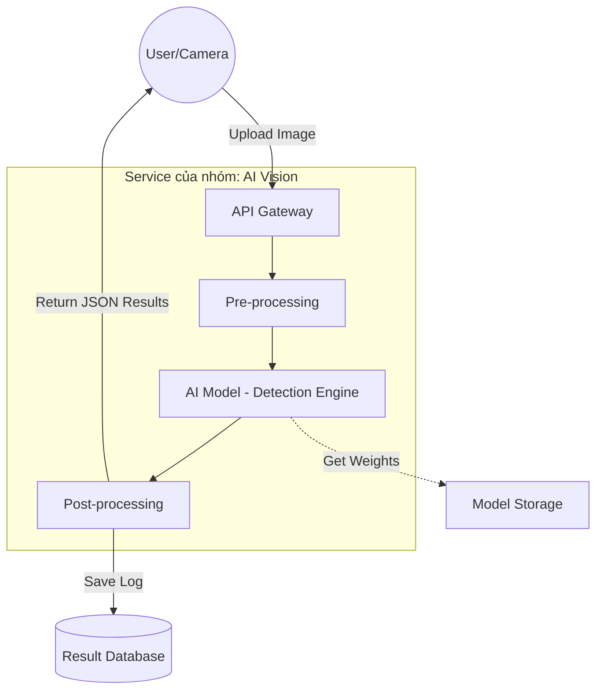

Service Boundary của nhóm AI Vision

1. Thông tin nhóm
   Tên nhóm: [Điền tên nhóm của bạn]
   Lớp: [Điền lớp của bạn]
   Thành viên: Kiên Đỗ
   Service nhóm phụ trách: AI Vision Analysis Service
   Sản phẩm tổng thể của lớp: Hệ thống giám sát và phân tích thông minh (Product B)
2. Actor
   Hệ thống Camera/IoT: Tự động gửi luồng dữ liệu hình ảnh về để phân tích.
   Người dùng cuối (User): Tải ảnh trực tiếp lên để kiểm tra đối tượng.
   Hệ thống quản trị (Admin): Theo dõi hiệu suất của model AI và cấu hình các tham số nhận diện.
3. System Boundary
   Phần nhóm kiểm soát:
   AI Model (YOLO/CNN): Bộ não chịu trách nhiệm nhận diện vật thể.
   Vision API: Cung cấp các cổng giao tiếp để bên ngoài gửi ảnh vào.
   Processing Logic: Tiền xử lý ảnh (resize, chuẩn hóa) trước khi đưa vào AI.
   Phần nhóm chỉ tích hợp:
   Image Storage: Nơi lưu trữ file ảnh vật lý (S3 hoặc MinIO).
   Auth Service: Hệ thống xác thực người dùng chung của cả lớp.
4. Service Boundary
   Trách nhiệm: Nhận dạng vật thể, phân loại nhãn (Labeling), xác định vị trí (Bounding Box) và trả về kết quả dưới dạng JSON.
   KHÔNG làm gì: Không chịu trách nhiệm hiển thị giao diện người dùng (UI), không xử lý việc lưu trữ lâu dài các file ảnh gốc.
5. Input / Output
   Input
   File hình ảnh (Binary/Base64) hoặc đường dẫn URL của ảnh.
   ID của loại vật thể cần ưu tiên nhận diện.
   Output
   Danh sách đối tượng phát hiện được (Object List).
   Tọa độ khung hình $(x, y, w, h)$ cho mỗi đối tượng.
   Tỷ lệ tin cậy (Confidence Score) từ $0$ đến $1$.
6. API dự kiến
   
7. Phụ thuộc service khác
   Gọi đến: Image Storage Service để lưu lại các ảnh đã được vẽ khung nhận diện (annotated images).
   Bị gọi bởi: API Gateway hoặc Core Business Service khi cần thông tin phân tích để ra quyết định.
8. Sơ đồ minh họa

